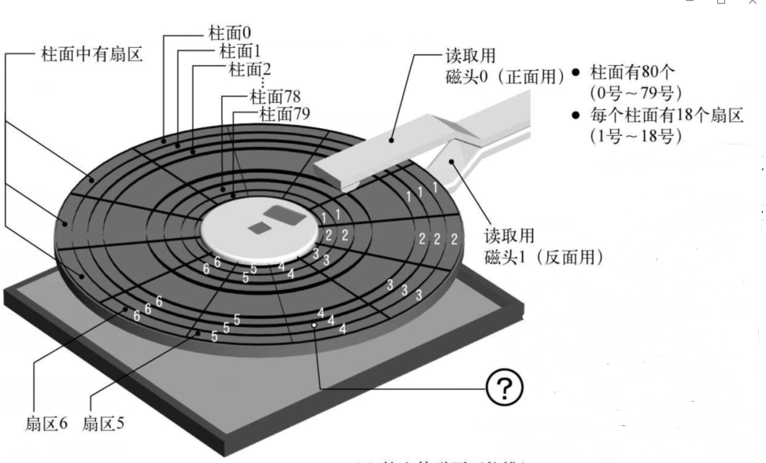
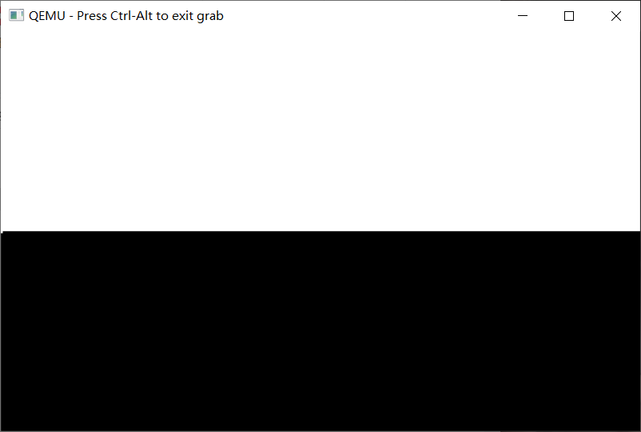
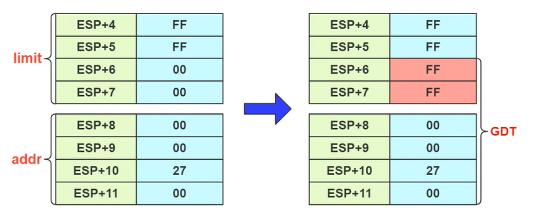
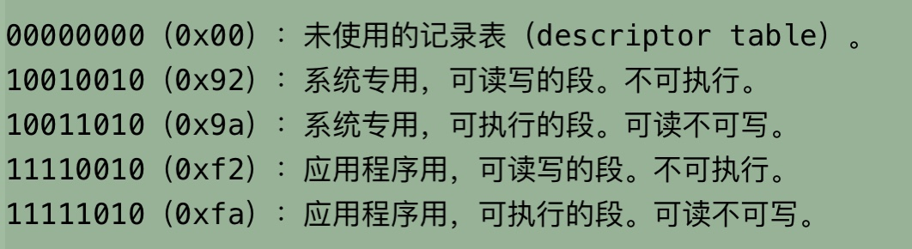
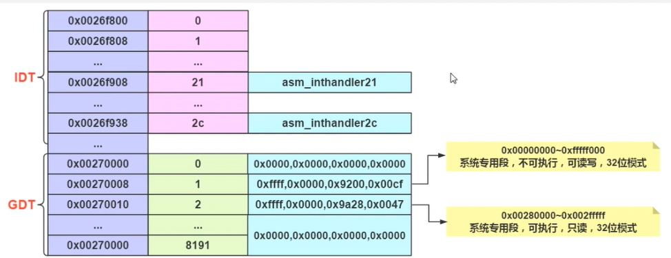
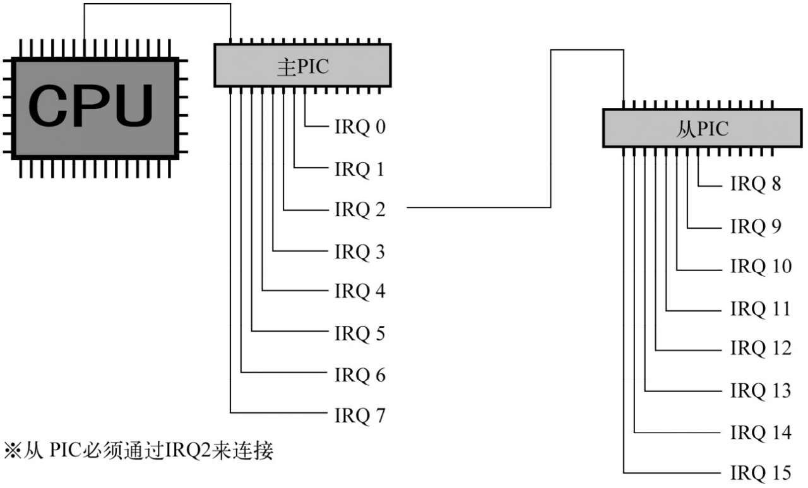
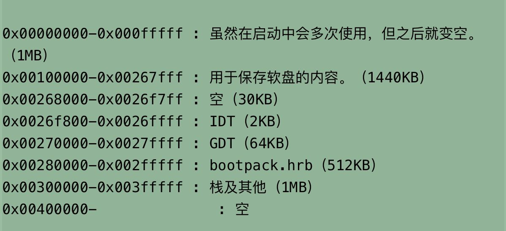
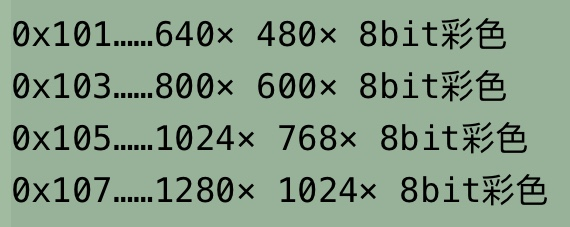
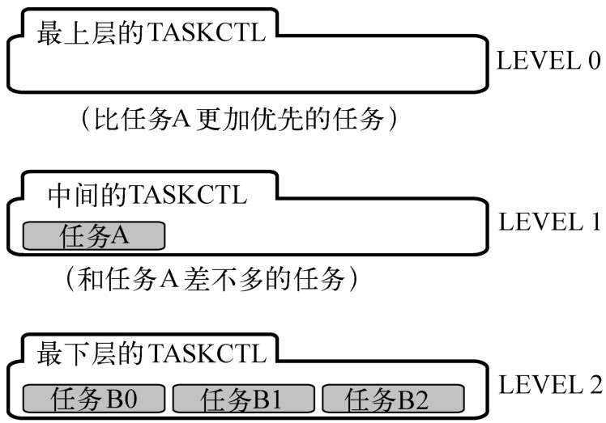
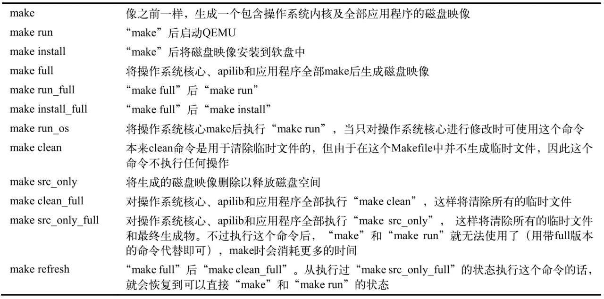

# 30天自制操作系统

## 开发流程

1. 准备一块软盘
2. 写启动区
   1. 软盘内容装到内存：顺序：扇区S(1-18)->正反H(0,1)->柱面C(0-79)
   2. 设置显示模式作为测试
3. 内存写入，屏幕显示
   1. 显示窗口
   2. 设定调色板
   3. 尝试绘制图形
   4. 绘制文字
4. 分割编译与中断处理
   1. 分段分页
   2. 初始化PIC
   3. 信号中断
   4. 键盘鼠标的控制，键盘中断
5. 设置FIFO和栈
   1. 设置fifo
   2. 激活鼠标：鼠标fifo，鼠标控制电路，鼠标中断，鼠标控制
6. 内存管理
   1. 检查内存
   1. 内存分配和释放
7. 图层叠加处理
   1. 判断范围，更新buf
8. 消除闪烁
9. 设置定时器
10. 修改分辨率
11. 键盘输入
12. 多任务
    1. 任务切换
    2. 任务优先级
    3. 任务level
13. 命令行窗口
    1. 绘制窗口
    2. 字符串输入
    3. 大写小写字母，符号数字的输入
    4. 键盘指示灯控制
    5. 换行和滚动
    6. 写命令指令
14. 读取文件信息
    1. 处理特殊标识符
    2. 对FAT的支持
15. 启动应用程序
    1. API
    2. 不随操作系用版本改变的API，分配INT
    3. 自由设置应用程序名

16. 操作系统的保护机制
17. 应用程序API
    1. 写字符串
    2. 显示窗口
    3. 图形处理
       1. 绘制图形

    4. 窗口操作
       1. 刷新窗口，关闭窗口，切换窗口，移动窗口

    5. 命令行的操作

18. 应用程序保护
19. 库
20. 文件操作API
21. 命令行API
22. 文件解压缩操作
23. 书写标准函数

## 执行流程

1. 重新创建全局段号记录表GDT，中断记录表IDT
2. 初始化可编程中断控制器PIC
3. 执行 io_sti()
3. 初始化缓冲区
3. 初始化图层信息
4. 初始化调色板和画面
4. 初始化鼠标显示
4. 初始化定时器

## CPU

- 只能处理 0 1 两个电信号
- 四位二进制构成一位十六进制
- cpu访问内存的速度要比访问寄存器慢很多
- `0xf0000`附近存放着BIOS程序，用户不能使用
- `0x00007c00-0x00007dff`启动区内容装载地址
- CPU和设备相连，out信号向设备发信息，in信号接收设备信息
- CPU进行模式转换时一定要屏蔽中断

## 汇编指令

- `;`：注释
- `DB`：写字符串
- `DW`：define world
- `DD`：define double world，4字节，32位
- `$`：1.输出之前字节数。2.将要读入的内存地址。
- `RESB	0x1fe-$`：填写0x00直到0x001fe
- `ORG`：指明程序的装载地址
- `JMP`：跳转
- `entry`：标签的声明，用于指定`JMP`的目的地
- `MOV`：复制赋值
- `[]`：表示内存地址  `MOV AL,[SI]`表示把SI地址的一字节内容读到AL中
- `ADD`：加法
- `CMP`：判断是否相等
- `JE`：条件跳转，如果比较结果相等跳转

~~~ARM
CMP AL,0
JE fin	;如果AL==0，跳转到fin
~~~

- `JB`：条件跳转，如果小于，就跳转
- `INT`：中断跳转
- `HLT`：让CPU停止动作，进入待机状态，等待外部发生变化CPU被唤醒。可用于防止CPU空转
- `EQU`：#define `CYLS EQU 10` == `#define CYLS 10`
- `PUSHFD`：将标志位的值按照双字长压入栈
- `POPFD`：将标志位的值按照双字长从栈弹出
- `NOP`：让CPU休息一个时钟长的时间

## 启动区

- 软盘第一个扇区称为启动区，如果最后两个字节不是`0x55 AA`计算机会认为这张盘没有所需的启动程序
- 计算机以512个字节位一个单位进行读写，称为一个扇区
- 由于操作系统往往很大，在启动区只放一个IPL（启动程序加载器）

## 寄存器

- `AX`：累加寄存器`AH AL`
- `CX`：计数寄存器`CH CL`可用作柱面号，扇区号
- `DX`：数据寄存器`DH DL`可用作磁头号，驱动器号

- `BX`：基址寄存器`BH BL`
- `SP`：栈指针寄存器
- `BP`：基址指针寄存器
- `SI`：源变址寄存器
- `DI`：目的变址寄存器
- 在这些16位寄存器前加E，就成了32位寄存器的表示
- 段寄存器
  - `ES`：附加段寄存器
  - `CS`：代码段寄存器
  - `SS`：栈段寄存器
  - `DS`：数据段寄存器,默认段寄存器
  - `FS  GS`：没有名称
- 标志寄存器`FLAGS`
  - `JC`：进位标志位是1，就跳转
  - `JNC`：进位标志位是0，就跳转

## 软盘

- 一张软盘有80个柱面，18个扇区，两个磁头
- 一个扇区有512个字节

$$
一张软盘的容量 = 80\times2\times18\times512=1474560Byte=1440KB
$$

- 含有ILP启动区，位于C0-H0-S1 ，CX代表柱面X号，H0代表正面,H1代表背面 ，SX表示扇区X号

- 读取下一个扇区

~~~ARM
MOV AX,ES	
ADD AX,0X0020	; == 512/16
MOV ES,AX	;前三步让内存地址ES后移512/16
ADD CL,1
CMP CL,18	；一共18个柱面，不能超了
~~~

- 向一个空软盘保存文件时，文件名会写在0x002600以后的地方，文件内容会写在0x004200以后的地方

## 高级语言编译过程

.c -> .gas

.gas -> .nas

.nas -> .obj(目标文件)

.obj -> .bim（二进制映像文件）

.bim -> .hrb

.bin + .hrb -> .sys

## 屏幕显示测试demo

~~~ARM
;写在源代码【画面モードを設定】后
		MOV		BX,DS
		MOV		AX,0xa000
		MOV		DS,AX
		MOV		SI,0	;初始化[DS:SI]  0xa0000 
draw:
		MOV		[SI],BYTE 15	;白色
		ADD		SI,1
		CMP		SI,320*100	;320*100窗口上半区
		JBE		draw
		MOV		DS,BX
~~~

## 指针的底层

~~~cpp
char *p;
p = (char*)i;
*p = i&0x0f;
~~~

~~~ARM
;equal to
	MOV ECX,i	;寄存器
	MOV [ECX],(i&0x0f)	;内存地址
~~~

~~~cpp
a[2];
2[a];
*(a+2);
*(2+a);
//等价

(*stu).val;
stu->val;
//等价
~~~

## 分段

- 按照自定义方式将内存分成很多块，每一块的起始地址都当作0处理，这样的块称为段
- 分段使用的是段寄存器
- 段的信息
  - 段的大小
  - 段的起始地址
  - 段的属性管理（禁止写入，禁止执行，系统专用等）
    - 本身12位和段上限的4位一起构成16位段属性

- GDT（全局段号记录表）放在内存中，记录段的起始地址
- 在CPU的GDTR存储内存的起始地址和有效设定个数
  - 低16位表示段上限，高32位表示表示GDT的开始地址
- 步骤 
  - `_load_gdtr`：限定段上限和地址值赋值给GDTR的48位寄存器，用到指令`LGDT`

## 分页

- 段的上限是32位（4GB），存段信息时，如果直接存（本身4字节，基址4字节），已经占满32位，没地方管理属性了
- 有12位的段属性，所以段上限只能用20位，即1MB

- 在段的属性里设立一个Gbit标志位，当他是1的时候，limit的单位不解释为字节，而是页（一页是4KB）
- 因此 4KB * 1MB = 4GB

## 分割编译

- 函数分割，将函数放在不同.c文件，方便修改查找；但造成makefile复杂
- 用一般规则简化makefile，但如果写了特定的生成规则，那将优先，类似函数模板

~~~C
%.gas : %.c Makefile
    $(CC1) -o $*.gas $*.c
    
%.nas : %.gas Makefile
    $(GAS2NASK) -o $*.gas $*.nas
~~~

- 整理头文件，将重复的东西放到头文件并包含之

## 中断

- 轮询的话，有些应急事件无法及时响应，所以需要中断。而且CPU可以不把精力用在查询上，集中在处理任务上

- IDT（中断记录表），CPU遇到某些事件切换过去执行
- IDT记录了 （0~255）的中断号码和调用函数的对应关系

### 中断标志

中断标志为1表示立即处理中断

中断标志为0表示忽略中断请求

- `CLI`：将中断标志置0
- `STI`：将中断标志置1

### PIC

- 可编程中断控制器
- 将8个中断信号集合成一个中断信号，8个信号按照或的方式通知cpu
- 分类
  - 主PIC：负责0-7号中断信号
  - 从PIC：负责8-15号中断信号
  - 如果主pic不通知CPU，从pic的信号就不能传达给CPU

- PIC的寄存器
  - IMR：中断屏蔽寄存器，中断的时候屏蔽其他中断防止混乱
  - ICW：初始化控制数据，有四个ICW，但可支配的只有ICW2，它决定了IQR按照那种中断通知CPU
  - CPU收到中断信号，命令PIC发送两个字节数据，`0xcd 0xXX`等价于`INT 0xXX`，CPU执行对应的INT指令

### 中断处理程序

- 执行某指令后，IF（中断许可标志位）变为1，CPU接受来自外部设备的中断，执行对应的**中断处理程序**

- 中断函数执行完要重启对于中断的监视

### 加快中断处理

- 如果中断处理的太慢，就会影响接收其他中断
- 处理方法：将按键的编码接受下来，存到变量里，由程序偶尔查看一下这个变量，如果有数据就把他显示出来
- 一个变量还是慢，需要用一个队列存储

### FIFO

~~~c
struct KEYBUF{
    unsigned char data[32];
    int next_r,next_w,len;
}
//用一个队列存储输入的信息
//当指针到达队尾，重设为0
~~~

## 内存

### 分布图

### 高速缓冲存储器（cache memory）

- 在CPU里的存储器，容量小，速度快，价格贵
- 访问内存时，将内存的地址和内容存到cache里，下次用这个地址的信息，马上就能从cache拿到
- 往内存写数据时，先将数据写到cache里，缓存控制点路再配合内存速度慢慢写到内存里
- 遇到循环，再cache里计算后将结果存入内存，而非多次存入覆盖。

### 检查内存

- 写入内存一个值再读出来是否一致
- 此时需要关闭cache

### 内存管理

- 标记为1表示正在使用，标记为0表示空着

  - 内存分配：比如需要100KB的空间，以字节（4KB）为单位管理只要找到连续的25个0即可，并设为1

  - 内存释放：归还的时候用地址除以单位内存，将其设为0
  - 占用内存较多，存储着每块内存的状态。大块内存分配需要遍历很久

- 空间使用记录表
  - 从xxx开始的yyy字节的空间是空着的。
  - 内存分配：遍历找到合适大小的可用空间，将其从表中删除，如果这块空间大小变为0，就删除这条信息
  - 内存释放：表里增加一条可用空间信息，检查这段空间能否和相邻空间合并，能合并，将他们归纳为1条
  - 占用内存较小，大块内存分配释放迅速
  - 管理较为复杂，当空间管理表用完，先割舍小块内存，等到表有空余再放入；或者切换回上一种方法

### 分配内存技巧

~~~c
//二进制，16进制
	//以0x1000为单位向下取整
	i = i & 0xfffff000;

	//以0x1000为单位向上取整
	i = (i + 0xfff) & 0xfffff000;

//10进制
	//以x为单位向下取整
	i = (i/x)*x;
	//or
	i = i - (i % x);
~~~

- 因为与运算比除运算快，所以 使用 2 的倍数取整分配内存，速度要快于其他数字

## 图层管理

~~~c
#define MAX_SHEETS 256	//最大管理图层数
struct SHTCTL{
  unsigned char *vram;//vram地址
  int xsize,ysize,top;//vram大小，最上面图层的高度
   struct SHEET *sheets[MAX_SHEETS];//将sheet0按高度排序后放到这里
   struct SHEET sheets0[MAX_SHEETS];//存放256个图层的信息
};
~~~

### 提高叠加处理速度

- 鼠标移动不该刷新整个画面，只需要刷新鼠标经过的地方

~~~c
for(遍历x方向)
{
    更新鼠标的x;
    for(遍历y方向)
    {
        更新鼠标的y;
        if(在鼠标的范围内)
        {
            update图层buf颜色信息;
        }
    }
}
~~~

- 在图层上显示文字也不该刷新所有像素点，只需要刷新缓冲区的坐标像素即可；计算范围的时候应该遍历刷新范围即可（AABB包围盒）

### 消除闪烁

- 由于某一个地方刷新的时候，会从最后一个图层到最顶部的图层一 一开始刷新，这个顺序过程显示出来就会闪烁

- 当图层移动可能导致下面图层露出来：从最下面开始刷新
- 图层移动到的地方，旧的图层不需要刷新，最要刷新新来的和他之上的图层即可
  - 鼠标是最高的层，需要一直刷新，可能会闪烁
- 创建VRAM的ZbufferMAP

## 定时器

- 设定PIT（可编程间隔型定时器），每隔固定时间间隔产生一次中断给IRQ

### 超时功能

- 到一定时间提醒main执行任务

~~~c
struct TIMERCTL
{
    unsigned int count;//计数器个数
    unsigned int timeout;//为0时往fifo发送data，提醒
    struct FIFO8 *fifo;
    unsigned char data;
};
~~~

### 多个定时器

~~~c
#define MAX_TIMER 500
struct TIMER
{
    struct TIMER *next;
	unsigned int timeout,flags;
    struct FIFO32 *fifo;
    int data;
}

struct TIMERCTL
{
	unsigned int count,next;
    //next记录下一个最近任务的计数器，避免每次都遍历一次 //0.3s->5s->8s
    struct TIMER *t0;
    struct TIMER timers0[MAX_TIMER];//排好序放到timers里
}
~~~

### 时刻调整程序

- count最大0xffffffff，大概500天，超过这个数值就不能计数了
- 可以设定一个定期调整时间的程序

### 定时器优化

- 数组队列，添加删除定时器需要整体移位，头始终不变
- 链表队列，添加删除定时器不需要移位，但需要遍历找队列的头
- 链表队列+哨兵，添加删除队列不需要移位且时可能找到队列的头

## 分辨率

- VEB画面模式号码

## 键盘输入

- 按下按键的数值 + 0x80 就是松开时候的数值

## 多线程

- 为了同时运行多个程序
- 切换的间隔不能太小，否则太浪费资源，而且切换时间太长
- 切换时，CPU会将所有寄存器的值全部写入内存，为了以后切换回这个程序时可以从中断的地方继续运行。然后从另一块内存读取数值到寄存器，这样就是一次切换
- TSS（任务状态段）：包含
  - 与任务设置相关的信息
  - EIP（扩展指令指针寄存器）：记录下一条执行的指令在哪个地址的寄存器
- JMP指令：
  - 只改写EIP的模式称为near模式，同时改写EIP和CS的称为far模式
  - JMP的目的地址段不是可执行的代码，是TSS的话，CPU会将这条指令认为**任务切换**，跳过去执行
- 步骤

~~~c
//创建每个任务的tss
struct TSS32 tss_a,tss_b;

//向成员填上合适的参数
tss_a.ldtr = 0;
tss_a.iomap = 0x40000000;
tss_b.ldtr = 0;
tss_b.iomap = 0x40000000;

//在GDT中定义
struct SEGMENT_DESCRIPTOR *gdt = (struct SEGMENT_DESCRIPTOR*)ADR_GDT;
set_segmdesc(gdt + 3,103,(int)&tss_a,AR_TSS32);//gdt的3号，段长103字节
set_segmdesc(gdt + 4,103,(int)&tss_b,AR_TSS32);

//TR寄存器，让CPU记住当前执行的任务，切换任务他也更新，赋值时 编号*8
load_tr(3*8);
//ARM
_load_tr:
	LTR		[ESP+4]
    RET
        
//切换任务
_taskswitch4://跳到4
	JMP		4*8:0
    RET
        
_taskswitch3://跳到3
	JMP		3*8:0
    RET
//写成整体函数
_farjmp:
	JMP		FAR[ESP+4]
    RET

//两个任务中设置切换间隔为0.02s
        
//把需要共享的变量存到内存，谁需要谁访问
//task_a
*((*int)0x0fec) = (int) sht_back;
//task_b
sht_back = (struct SHEET*)*((int*)0x0fec);

//不能让程序知道自己在被来回切换
//将切换封装在某个函数里
~~~

### 任务管理自动化

~~~cpp
struct TASK
{
    int sel,flags;//sel存放GDT编号
    struct TSS32 tss;
};

struct TASKCTL
{
  int running;//正在运行的任务数量
  int now;//当前运行的任务号
    struct TASK *tasks[MAX_TASKS];
    struct TASK tasks0[MAX_TASKS];
};
~~~

### 任务的休眠和唤醒

- 当一个线程空闲的时候将其休眠，将cpu留给其他线程使用，提高效率
- 不需要时将进程休眠，需要时将她唤醒

### 设定任务的优先级

- 体现在给不同任务分配的切换间隔上，优先级数字越大，单次分配的时间越长

~~~c
struct TASK
{
    int sel,flags;//sel存放GDT编号
    int priority;//优先级
    struct TSS32 tss;
};
~~~

- 设定优先级后在设定，切换定时器时使用
- 一般将0代表不改变优先级，用于休眠后的唤醒 task_run(fifo->task,0);

- 将键盘鼠标，网络处理，播放音乐的输入设为高优先级，积极响应用户操作，然后给这个任务分配休眠唤醒机制，当没有输入的时候这个任务从tasks中删除，CPU全部分给其他任务使用

### 处理多个高优先级任务

- 创建几个TASKCTL or 在TASKCTL中创建多个tasks[]

- 只要上层的TASKCTL中有任务，就完全忽略后面的TASKCTL
- 当一层的任务都执行完，才轮到下一层执行
- 当高的level有新任务，必须马上切换回去执行

~~~c
#define MAX_TASKS_LV 100
#define MAX_TASKLEVELS 10

struct TASK
{
    int sel,flags;	//sel放GDT编号
    int level,priority;	//level记录自己的层级，priority记录优先级
    struct TSS32 tss;
};

struct TASKLEVEL
{
    int running;//记录运行的任务数
    int now;//记录当前运行的是哪个任务
    struct TASK *tasks[MAX_TASKS_LV];
};

struct TASKCTL
{
    int now_lv;//记录现在活动的level
    char lv_change;//在下次切换时是否需要改变level
    struct TASKLEVEL level[MAX_TASKLEVELS];
    struct TASK tasks0[MAX_TASKS];
};
~~~

- 当所有level都没有任务，就执行HTL休眠

## 指令

- mem查看内存
- cls清屏
- dir显示文件信息
- type 文件名.格式名
- exit 退出命令行
- start 开启新的命令行并运行应用程序
- ncst 直接运行应用程序

## FAT（文件分配表）

- 记录文件在磁盘的存放位置

- 文件在磁盘没有存放在连续的扇区，这种情况被称为“磁盘碎片”。

## API（系统调用）

- 应用程序对操作系统功能的调用

- 应用程序所在的段是1003\*8，操作系统在2\*8

- 不随操作系用版本改变的API：
  - 分配INT，但IDT只有256个，很快会用光
  - 在寄存器（一般用AH）存入功能号，定义每个号码代表的函数

~~~c
void hrb_api(int edi,int esi,int ebp,int esp,int ebx,int edx,int ecx,int eax)
{
	struct CONSOLE *cons = (struct CONSOLE*)*((int*)0x0fec);
    if(edx == 1)
    {
		cons_putchar(cons,eax &0xff,1);
    }
    else if(edx == 2)
    {
        ...
    }
    ...
    return;
}
~~~

## 保护操作系统

- 为应用程序提供专门的内存空间，禁止访问系统空间
- 异常机制：在中断号中注册一个函数，当在操作系统指定应用程序用的DS中的应用程序试图破坏操作系统或者试图违背操作系统的设置时，就会产生0x0d中断，该中断称为异常
- 当破坏行为忽略上述DS,直接将操作系统用的段地址存入DS，仍能破坏操作系统
  - 解决之道：让操作系统向应用程序用的段执行RETF（从栈取出地址然后JMP），强制结束应用

## 保护应用程序

- LDT（局部段表）仅对某个应用程序有效
- 将应用程序放在LDT里，其他任务无法使用该LDT，就不用担心它被其他应用程序破坏了

## 库

- .lab 包含很多.obj

## 整理文件目录

## 文件操作和文字显示

- open
- seek 寻找
- read
- write

- close
